# MegaWidget International Cashflow Analysis

*Tools Used: Microsoft Excel, Visual Basic for Applications (VBA)*

Refer to the worksheet [megawidget_intl_cashflow.xlsm](/megawidget_intl_cashflow.xlsm) for a detailed and interactive report. 

## 1. Introduction

This project involves designing, developing, and testing a dynamic spreadsheet model to support financial decision-making for a small computer manufacturing company. The model will take the form of a cash flow forecast, enabling the business to conduct what-if analysis—for example, assessing the impact of loaning plan, discount scheme, or fluctuations in company profitability.
The scenario is based in MegaWidget International, a manufacturing company that produces precision metal components for clients across Europe. The spreadsheet will help the company anticipate and manage its financial performance under varying business conditions, making it a vital tool for strategic planning and risk management.

The scenario is based in MegaWidget International, a manufacturing company that produces precision metal components for clients across Europe. The spreadsheet will help the company anticipate and manage its financial performance under varying business conditions, making it a vital tool for strategic planning and risk management.

## 2. Worksheet Guides and Insights

The steps involved and the data tables utilised for the tasks are illustrated in the diagram below.

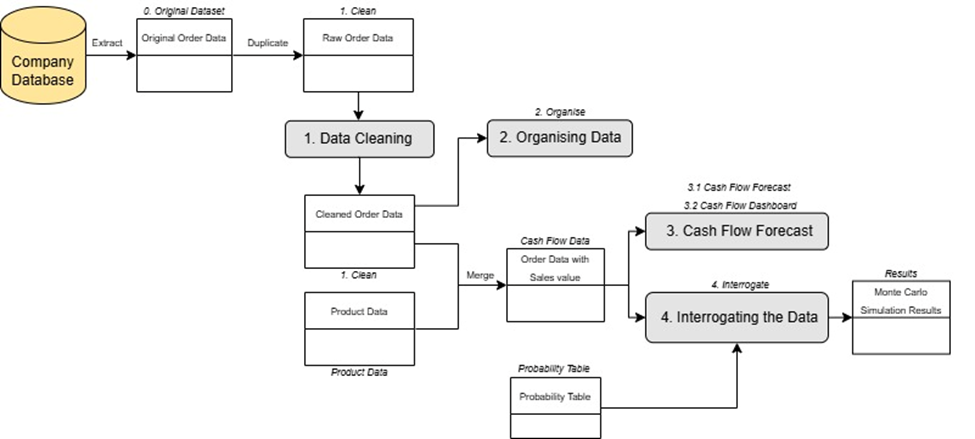

### 2.1. Cleaning Data

**Sheet:** `1. Clean`
**Available Actions:**
- `CLEAN DATA`: Executes all necessary data cleaning operations on the dataset.
- `REFRESH`: Updates the data table in the "1. Clean" sheet using the latest information from the "0. Original Dataset" sheet.

### 2.2. Sales Summary

**Sheet:** `2. Organise`v
**Available Action:**
- `REFRESH`: Applies updates in the following order—first, it cleans the data in the “1. Clean” sheet to ensure accuracy. Then, it refreshes all Data Tables in the “2. Organise” sheet to reflect the latest changes.

**The total monthly sales by volume of product codes B, D and E, for the period covered by the data (Jan 2020 - Dec 2022):**

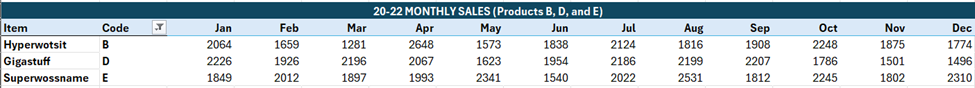

- `Gigastuff` shows the most consistent sales throughout the months, hovering around `2000`, with less extreme fluctuations than the other two products.
- `Hyperwotsit` has the most volatile sales pattern, with a low of `1281` (`Mar`) and peak at `2648` (`Apr`).

**Monthly sales by region of the Megawidget (A1, A2, and A3) products, for the WC, WS, HS and CW postal code areas, over 3 years (2020 - 2022):**

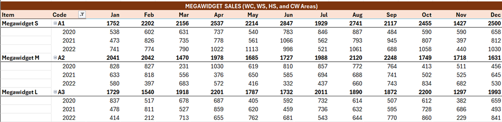

- `Megawidget S` is the most consistently growing product. Despite seasonal fluctuations, the overall trend suggests increasing demand.
- `Megawidget M` and L show declining or unstable Sales. With March and May exhibit sharp drops in sales, hinting at inconsistent demands.
- `Megawidget L` shows a gradual decline in total sales, especially in the second half of the year.

### 2.3. The Cash Flow Forecast for the new Manufacutring Facility Project

The Financial Model to estimate the following year (`2023`) cash flow of MegaWidget International. With plans to build new manufacturing facilities for producing company-owned **B, D, and E products**.

**Sheets:** `3.1 Cash Flow Forecast` and `3.2 Cash Flow Dashboard`
**Available Actions:**
- `CHANGE PLANS`: Open the “Change Financial Plans” user form to modify loan and costing details.
- `REFRESH DATA`: Applies updates in a sequential process—first, it cleans the data in the “1. Clean” sheet to ensure accuracy. Then, it updates the “Cash Flow Data” sheet with the cleaned data. Finally, the Balance Sheet in the “3.1 Cash Flow Forecast” sheet is refreshed to reflect the latest changes.
- The financial plan is also modifiable in the dashboard available in “3.2 Cash Flow Dashboard”.

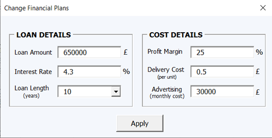

Initially, with the proposed loaning plan of `£650,000` in `10 years`, with `4.3%` interest rate, and the current profit margin of `25%` and advertising cost of `£30,000` per month:

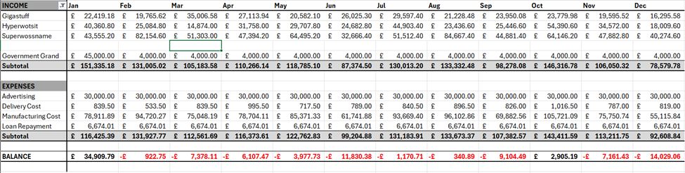

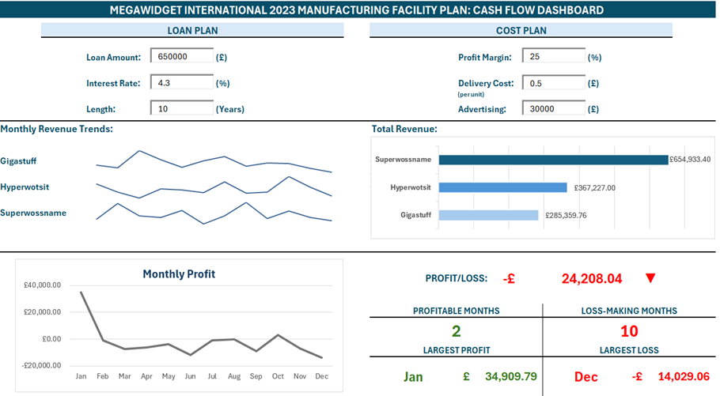

As per the visualisations in the Dashboard above, the current loaning and financial plan is not feasible, with profit losses in `10 months`, and a total yearly loss of `£24,208`. 

Thus, to remain profitable for the whole year with a total profit of `£157,410`; the company must change their loaning length to `15 years`, negotiate interest rate to `4%`, increase profit margin to at least `28%,` and keep the advertising cost as low as `£20,000` per month (as below).

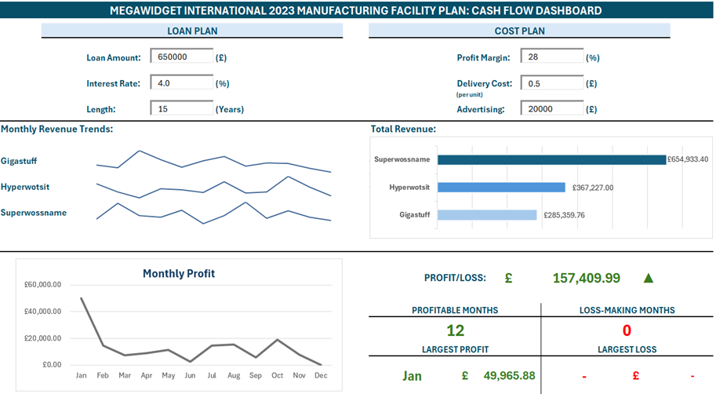

### 2.4. Financial Changes from a New Delivery Service Provider

The company has been offered a flat-rate delivery charge of  `£14.95` per order, regardless of the size of the order.

Based on the results below, switching to a new delivery provider appears to be a highly beneficial option. As this would have saved around `39%` delivery cost during the `20-22` period, with a significant `46%` savings in `2022` alone.

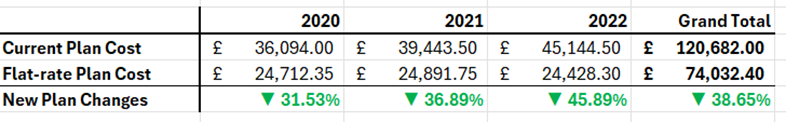

### 2.5. Discount Scheme Effects

The company is thinking about introducing a discount scheme for orders above a certain level:
- `3%` discount for orders above `20 cases`,
- `5%` for orders above `50 cases`.
- `7%` for orders above `100 cases`.

Assuming next year's sales in `2023` follow the same pattern as in `2022`, with an adjustable profit margin rate (e.g. `25%`).

Based on the results below, with the current `25%` profit margin, applying discount scheme would reduce `2023` revenue by `4.68%` and profit by `6.83%`.

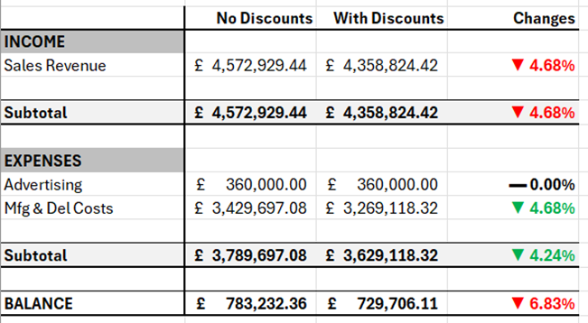

### 2.6. Sales Growth Prediction

#### Deterministic 2023 Sales Growth Model

- The company plans to increase sales by `5%` each month. 
- Using `December 2022` sales figure as a starting point, the Balance Sheet below shows how this affects the company’s profits and its monthly cash flow.

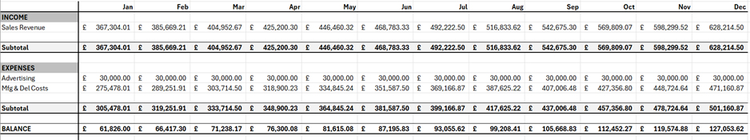

#### Monte Carlo Simulation for Sales Prediction

- Using actual `December 2022` Sales figure as the starting point. Refer to "Results" sheet for all iteration results.
- Assuming monthly sales changes follow a normal distribution centred around 0%, with a maximum deviation of `±30%`. Refer to "Probability Table" sheet for the detailed distribution.
- With `1000` iterations, the Monte Carlo Simulation results for `2023` monthly sales are presented below, demonstrating best cases, worst cases, and average results of all iterations.

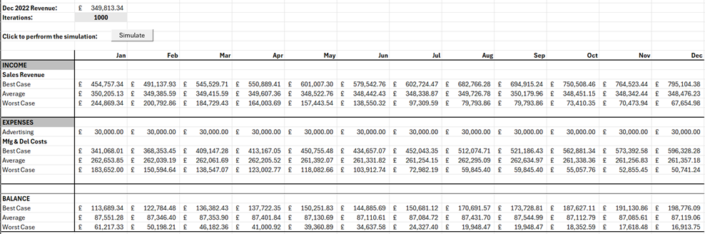

While the **Best-Case** projects steady growth reaching around `£200,000` by year-end, the **Worst-Case** predicts a continuous decline, with the **Average** remaining flat at `£87,000` and the Deterministic Model showing moderate growth of `5%`.

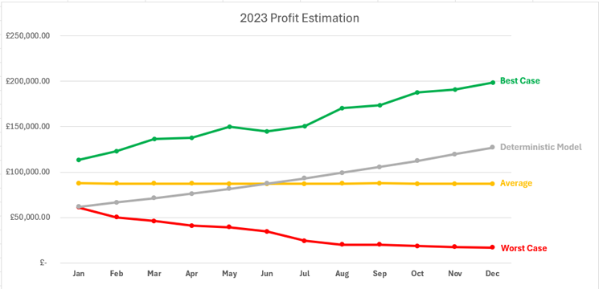

